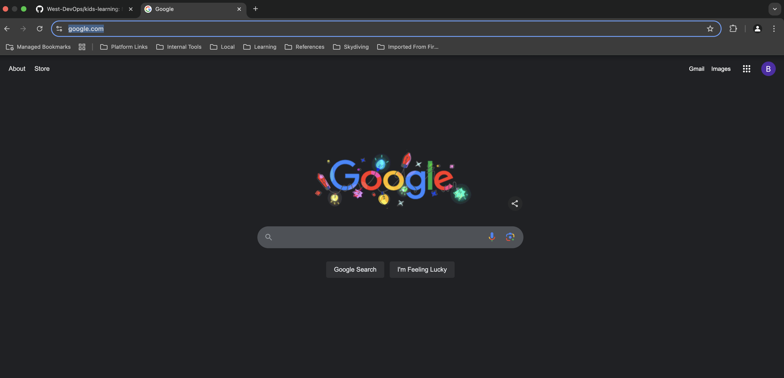
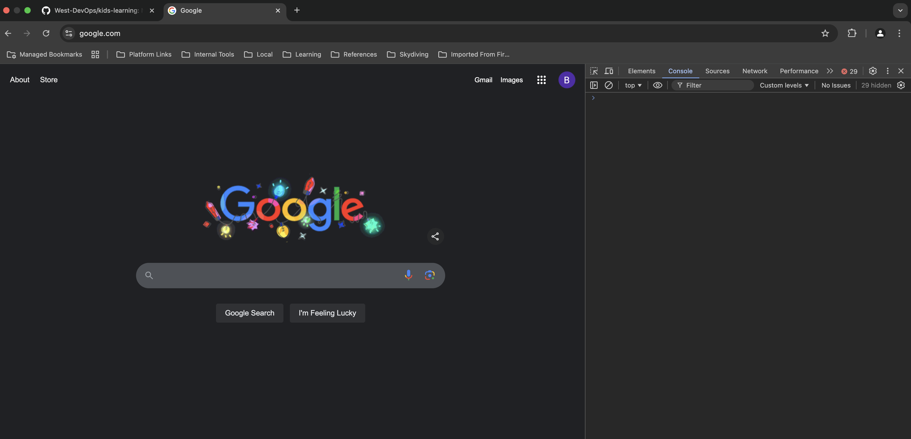
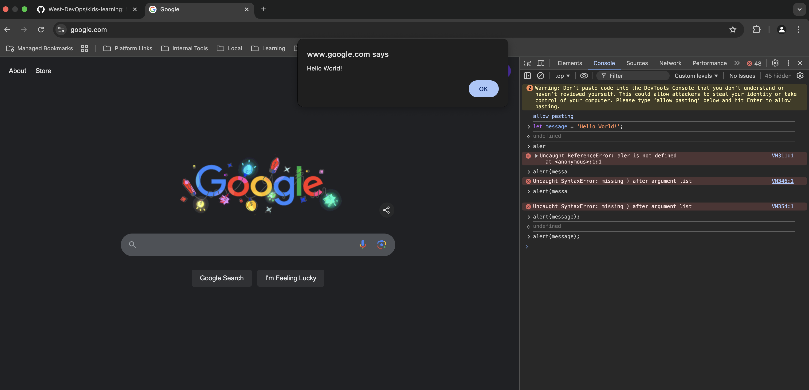

# JavaScript 101

This page will cover a few ways to get up and running with `JavaScript`.  As it is the language of the web 
all modern internet browsers (chrome/firefox/edge/etc.) have interpreters for it already baked-into them. 

## Executing javaScript in a web-browser

* Open up chrome (or whatever browser you use)
* Navigate to a website, I'll use [google search](https://www.google.com/) in this example



* Now press `F12` this will open up the "developer console" and if you click the `console` tab at the top: 



The empty screen on the right is now an interactive `JavaScript` console, so we can type into that box some `JavaScript`:

```javascript
let message = 'Hello World!';
alert(message);
```

This will create a pop-up alert in the screen: 



This is how many people start as it requires no additional downloading of runtimes or anything other than an internet
browser which nearly everyone already has.  However, there will come a point where you probably want to write your own 
programs which have nothing to do with internet websites/pages so you will need your own runtime installing on your 
machine, then we need to move onto: 

## Using NodeJs

This is a runtime for `JavaScript` so we can goto their [website](https://nodejs.org/en) and hit the 
"Download NodeJs (LTS)" button on the homepage. Once downloaded you can run through the installer just like any other 
piece of software you download off the internet.  Now we can write real programs and have an execution environment that 
is outside an internet browser (you can even write your own servers with this!) 

Let's start by opening `notepad` (not word, it puts markup (formatting) into the saved file and doesn't work for writing code)

```javascript
/*jshint esversion: 6 */
import * as readline from 'node:readline';

let rl = readline.createInterface({
    input: process.stdin,
    output: process.stdout,
});

await rl.question('What is your name? ', (userInput) => {
    console.log(`Hello ${userInput}`);
    rl.close();
});
```

This code is also available in the [examples](./examples/hello.js) folder. 

Save this file as `hello.js`. And you can now open the file with `node` and it will run: 

```text
$ node hello.js
What is your name? Ben
Hello Ben
```

From here on out the [Intro to node](https://nodejs.org/en/learn/getting-started/introduction-to-nodejs) is useful but
does expect a certain level of `JavaScript` knowledge!  

## Using an integrated development environment (IDE)

After some time you will probably tire of having to switch between `notepad` and the `cmd` window to run your programs. 
It is far more common to use a program which helps you write code, test it and run it all in one app.  These are called 
integrated development environments or just IDEs.  

There are literally hundereds of them to choose from.  However for a total beginner I would recommend: 

* [VSCode](https://code.visualstudio.com/download) basic IDE with plugin system for many languages.
* [Intellij Idea](https://www.jetbrains.com/idea/) my IDE of choice, is a `Java` IDE originally but again has a plugin system to allow it to understance